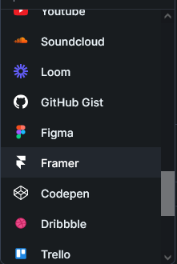

# Page 5

## Lorem ipsum

* list&#x20;
* list&#x20;

1. list 2&#x20;
2. list 2&#x20;

* [ ] Task list&#x20;
* [ ] Task list


HINTS can be here


```
// these are different boxes to put shit in

```

> YOU can also put quotes
>
> hi

**Lorem** _ipsum_ ~~dolor~~ `sit` [amet](../), <mark style="color:red;">consectetur</mark> <mark style="background-color:orange;">adipiscing</mark> elit, s$$f(x) = x * e^{2 pi i \xi x}$$ed do eiusmod tempor incididunt ut labore et dolore magna aliqua. Ut enim ad minim veniam, quis nostrud exercitation ullamco laboris nisi ut aliquip ex ea commodo consequat. Duis aute irure dolor in reprehenderit in voluptate velit esse cillum dolore eu fugiat nulla pariatur. Excepteur sint occaecat cupidatat non proident, sunt in culpa qui officia deserunt mollit anim id est laborum.

There are also a couple embedded widgets like youtube videos&#x20;

<details>

<summary>AsText(html)</summary>

Here is the hidden text dont need to have page indentations for this


</details>



tabs are also posiible&#x20;









| Table | this is a thing | you cna make |
| ----- | --------------- | ------------ |
| John  | doe             | Lorem        |
|       |                 | ipsum        |
|       |                 |              |
|       |                 |              |

you can also make custom links to your other embedded pages even on another document


[..](../)



[this is the other page](https://app.gitbook.com/s/zPKTxc7CUwXtyA3t1Bhh/)

